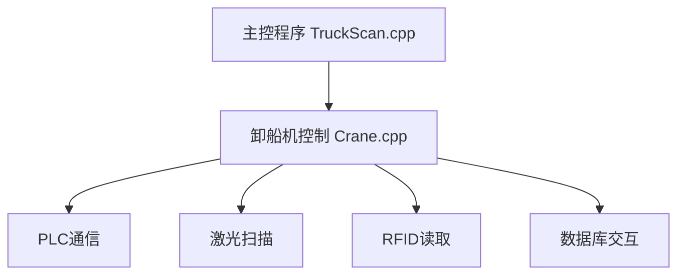
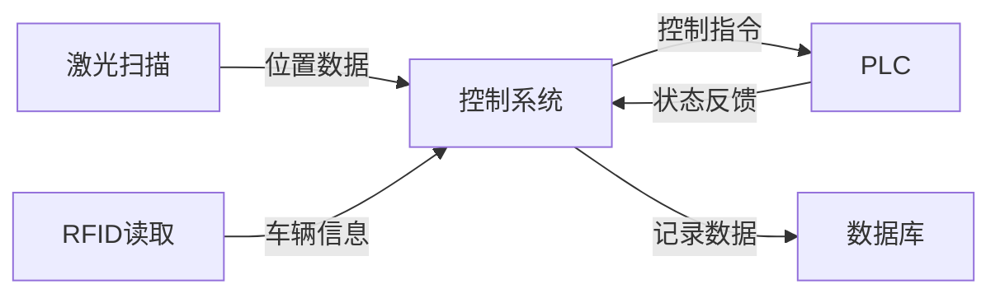

# 主要功能

让我分析一下 Crane.cpp 的主要功能：

<think>
1. 从代码结构和命名看，这是一个卸船机（Crane）控制系统的实现文件
2. 主要功能模块：
- 扫描器控制（激光扫描）
- RFID读取
- PLC通信
- 叉车控制
- 数据库操作
3. 核心业务逻辑：
- 检测卡车位置
- 控制装卸过程
- 安全监控
</think>

Crane.cpp 的主要功能：

1. 设备通信与控制：

```cpp
- 连接PLC：plc.ConnectTo(ipPLC, 0, 1)
- 扫描器通信：ConnectScan()
- RFID读取：OpenNetPort(6000, ipRFID, &fComAdr, &frmcomportindex)
```

2. 核心业务功能：

```cpp
Crane::ReadPLC()      // 读取PLC数据（设备状态）
Crane::Scan()         // 激光扫描检测卡车位置
Crane::Identify()     // RFID识别卡车信息
Crane::Calculate()    // 计算控制参数
Crane::WritePLC()     // 写入控制指令到PLC
```

3. 主要监控参数：

```cpp
CraneState  // 卸船机状态（0：空闲，1：卸货，2：装货）
TruckHave   // 是否有卡车在位
GrabTotal   // 需要抓取的次数
dTruckHead  // 卡车头部位置
dTruckTail  // 卡车尾部位置
```

简单来说，这个文件实现了一个自动化卸船系统，它能：

1. 自动检测卡车位置
2. 识别卡车信息
3. 控制卸船机进行装卸操作
4. 确保整个过程的安全性
5. 与数据库交互记录操作信息

这是一个工业自动化控制系统的核心组件。

# 工作流程

让我系统地解释这个卸船机控制系统的工作流程：

<think>
需要从以下几个方面解析：

1. 整体架构
2. 工作流程
3. 关键组件
4. 数据流向
   `</think>`

### 1. 系统架构



### 2. 工作循环

每个卸船机的工作循环（在 BeginCrane 函数中）：

```cpp
while(true) {
    1. Init()      // 初始化系统
    2. ReadPLC()   // 读取设备状态
    3. ForkliftPause() // 检查叉车安全
    4. Scan()      // 扫描卡车位置
    5. Identify()  // RFID识别卡车
    6. Calculate() // 计算控制参数
    7. WritePLC()  // 发送控制指令
}
```

### 3. 关键状态参数

```cpp
CraneState: 
    0 = 空闲
    1 = 卸货中
    2 = 装货中

TruckHave:
    0 = 无卡车
    1 = 有卡车

HopPos:    // 抓斗位置
GrabNum:   // 已抓取次数
GrabTotal: // 需要抓取总次数
```

### 4. 主要功能模块

1. **位置检测**：

```cpp
Scan() {
    // 使用激光扫描仪
    // 检测卡车头部位置(dTruckHead)
    // 检测卡车尾部位置(dTruckTail)
    // 判断卡车是否在正确位置
}
```

2. **车辆识别**：

```cpp
Identify() {
    // 读取RFID标签
    // 查询数据库获取车辆信息
    // 确定装卸任务参数
}
```

3. **安全控制**：

```cpp
ForkliftPause() {
    // 检测叉车RFID
    // 必要时暂停操作
    // 确保作业安全
}
```

### 5. 数据流向



### 6. 错误处理

系统在各个环节都有错误检查：

```cpp
- 设备连接状态检查
- 数据有效性验证
- 位置范围检查
- 安全参数监控
```

这个系统的主要目的是：

1. 自动化控制卸船机的装卸过程
2. 确保作业安全性
3. 提高作业效率
4. 记录作业数据

需要我详细解释任何特定部分吗？

# 代码结构分析

这个代码的整体结构是：

1. 基础设置部分（1-40行）

   - 头文件包含和宏定义
   - 构造函数（设置设备参数）
   - 析构函数（清理资源）
2. 核心初始化和状态控制部分（42-108行）

   - Init函数（初始化各种状态参数）
   - ReadPLC函数（读取PLC设备状态）
3. 安全监控部分（110-283行）

   - ForkliftPause函数（处理叉车安全控制）
   - RFID读取和数据库交互
4. 主要业务逻辑部分（285-489行）

   - Scan函数（扫描检测）
   - Identify函数（车辆识别）
   - Calculate函数（参数计算）
5. 设备通信部分（491-544行）

   - WritePLC函数（写入控制指令）
   - ConnectScan函数（扫描器连接）
6. 硬件驱动实现部分（546-1024行）

   - GetSICKLMS511函数（SICK扫描仪数据处理）
   - GetXXWXTL302函数（XT-L302扫描仪数据处理）
   - 

逐行分析 Crane.cpp 的结构：

1. 第1-11行：头文件和宏定义

```cpp
#define MAX_BUFF_SIZE 16384
#define MAX_REC_NUM 10
#define _USE_MATH_DEFINES
// ... 各种头文件包含
```

作用：定义常量和引入必要的系统及自定义头文件

2. 第13-32行：构造函数

```cpp
Crane::Crane(const char* Scan, const char* RFID, const char* PLC, const char* Forklift, int ScanType, unsigned char No,int Range, CDBConnetPool& DBPool)
```

作用：初始化卸船机对象，设置各种参数

3. 第34-40行：析构函数

```cpp
Crane::~Crane()
```

作用：清理资源，关闭连接

4. 第42-67行：Init() 函数

```cpp
int Crane::Init()
```

作用：初始化卸船机状态参数

5. 第69-108行：ReadPLC() 函数

```cpp
int Crane::ReadPLC()
```

作用：从PLC读取当前设备状态数据

6. 第110-283行：ForkliftPause() 函数

```cpp
void Crane::ForkliftPause()
```

作用：处理叉车安全控制，读取RFID信息判断是否需要暂停

7. 第285-321行：Scan() 函数

```cpp
int Crane::Scan()
```

作用：控制扫描器检测卡车位置

8. 第323-447行：Identify() 函数

```cpp
int Crane::Identify()
```

作用：识别卡车RFID，查询数据库获取相关信息

9. 第449-489行：Calculate() 函数

```cpp
int Crane::Calculate()
```

作用：根据扫描和识别结果计算控制参数

10. 第491-544行：WritePLC() 函数

```cpp
int Crane::WritePLC()
```

作用：将计算结果写入PLC控制设备

11. 第546-687行：ConnectScan() 函数

```cpp
int Crane::ConnectScan()
```

作用：建立与扫描器的网络连接

12. 第689-845行：GetSICKLMS511() 函数

```cpp
int Crane::GetSICKLMS511()
```

作用：处理SICK LMS511型激光扫描仪的数据

13. 第847-1024行：GetXXWXTL302() 函数

```cpp
int Crane::GetXXWXTL302()
```

作用：处理XT-L302型激光扫描仪的数据

每个部分都包含了详细的错误处理和日志记录功能，确保系统运行的可靠性。


好的，我来详细解释ReadPLC函数中的状态检查部分：

```cpp
int Crane::ReadPLC() 
{
    // ... 前面的PLC数据读取代码 ...

    // 状态检查1：检查卸船机编号
    if (currData[0] == 0 || currData[0] > 6 || currData[0] != CraneNo)
    {      
        LOG(ERROR) << "卸船机的编号不正确";
        closesocket(client);
        return -2;
    }      

    // 状态检查2：检查卸船机状态
    if (CraneState > 2)
    {
        LOG(ERROR) << "卸船机的状态不正确";
        closesocket(client);
        return -3;
    }

    // 状态检查3：检查抓斗位置上限
    if (HopPos > 3)
    {
        LOG(ERROR) << "卸船机的抓斗位置不正确";
        closesocket(client);
        return -4;
    }

    // 状态检查4：检查抓斗位置下限
    if (HopPos < 2)
    {
        LOG(INFO) << "卸船机的抓斗位置不在工作位";
        closesocket(client);
        return -5;
    }

    return 1;  // 所有检查通过
}
```

这些状态检查的具体含义是：

1. 卸船机编号检查：

   - 编号不能为0
   - 编号不能大于6
   - 编号必须与设定的CraneNo相匹配
   - 不满足条件则返回错误码-2
2. 卸船机状态检查：

   - CraneState只能是0(空闲)、1(卸货)或2(装货)
   - 如果大于2则状态无效
   - 不满足条件则返回错误码-3
3. 抓斗位置上限检查：

   - HopPos不能大于3
   - 超过上限说明位置异常
   - 不满足条件则返回错误码-4
4. 抓斗位置下限检查：

   - HopPos不能小于2
   - 小于2说明不在工作位置
   - 不满足条件则返回错误码-5

所有检查都通过时返回1，表示PLC数据读取和状态检查都正常。如果发生任何错误，函数会：

1. 记录相应的错误日志
2. 关闭客户端socket连接
3. 返回对应的错误码

这些检查确保了：

- 设备标识的正确性
- 运行状态的有效性
- 机械位置的安全性
- 工作条件的满足性

这是卸船机安全运行的重要保障机制。


让我详细解释ForkliftPause函数的实现和功能：

```cpp
void Crane::ForkliftPause()
{
    // 1. 状态检查
    if (iState != 2 || CraneState != 2)
    {
        Pause = 0;
        return;
    }

    // 2. 加载RFID读取器动态库
    HINSTANCE UHFReaderDll = LoadLibrary(L"UHFReader18.dll");
    if (UHFReaderDll)
    {
        // 3. 初始化变量
        long frmcomportindex = 0;
        unsigned char* EPC = new unsigned char[5000] { 0 };  // RFID标签数据缓冲区
        long Totallen = 0;  // 读取的数据总长度

        // 4. 获取动态库函数指针
        typedef long (WINAPI* Open)(int, const char*, unsigned char*, long*);
        Open OpenNetPort = (Open)GetProcAddress(UHFReaderDll, "OpenNetPort");
      
        typedef long (WINAPI* Inventory)(unsigned char*, unsigned char, unsigned char, 
                                       unsigned char, unsigned char*, long*, long*, long);
        Inventory Inventory_G2 = (Inventory)GetProcAddress(UHFReaderDll, "Inventory_G2");
      
        typedef long (WINAPI* Close)(long);
        Close CloseNetPort = (Close)GetProcAddress(UHFReaderDll, "CloseNetPort");

        // 5. 连接RFID读取器
        if (OpenNetPort)
        {
            unsigned char fComAdr = 0xFF;
            OpenNetPort(6000, ipRFID, &fComAdr, &frmcomportindex);
            if (frmcomportindex != 0)
            {
                // 6. 读取RFID标签
                long CardNum = 0;
                Inventory_G2(&fComAdr, 0, 0, 0, EPC, &Totallen, &CardNum, frmcomportindex);
              
                // 7. 处理读取结果
                if (CardNum == 0)
                {
                    LOG(INFO) << "卸船机周围没有叉车";
                    goto CleanForklift;
                }
                else if (CardNum == 1)
                {
                    if (Totallen > 16 || Totallen < 1)
                    {
                        LOG(ERROR) << "叉车的标识不正确";
                        goto CleanForklift;
                    }
                    LOG(INFO) << "卸船机周围有叉车，标识：" << EPC;
                }
                else
                {
                    LOG(INFO) << "卸船机周围有多辆叉车";
                    goto CleanForklift;
                }
            }
            else
            {
                LOG(ERROR) << "连接叉车RFID设备失败";
                goto CleanForklift;
            }

            // 8. 比较RFID标签是否发生变化
            for (int i = 0; i < Totallen; ++i)
            {
                if (forkliftRFID[i] != EPC[i])
                {
                    // 9. 查询数据库获取叉车信息
                    char c_Buff[35]{ 0 };
                    for (int i_RFID = 0; i_RFID < Totallen; ++i_RFID)
                        sprintf_s(c_Buff + i_RFID * 2, sizeof(c_Buff) - i_RFID * 2, "%02X", EPC[i_RFID]);
                  
                    int CraneID = (int)CraneNo;
                    LOG(INFO) << "卸船机编号：" << CraneID << "，叉车标识为：" << c_Buff;
                  
                    // 10. 数据库操作
                    _ConnectionPtr conn = DB.GetCon();
                    try
                    {
                        // 创建存储过程命令
                        _CommandPtr cmmdmy1;
                        cmmdmy1.CreateInstance(__uuidof(Command));
                      
                        // 设置存储过程参数
                        cmmdmy1->Parameters->Append(cmmdmy1->CreateParameter(_bstr_t("@CraneID"), adInteger, adParamInput, 4, CraneID));
                        cmmdmy1->Parameters->Append(cmmdmy1->CreateParameter(_bstr_t("@TruckID"), adVarChar, adParamInput, 30, c_Buff));
                        cmmdmy1->Parameters->Append(cmmdmy1->CreateParameter(_bstr_t("@GrabTotal"), adInteger, adParamOutput, 4));
                        // ... 其他位置参数 ...

                        // 执行存储过程
                        cmmdmy1->CommandText = _bstr_t("CheckTruckNo");
                        cmmdmy1->ActiveConnection = conn;
                        cmmdmy1->CommandType = adCmdStoredProc;
                        cmmdmy1->Execute(NULL, NULL, adCmdStoredProc);
                      
                        // 11. 处理结果
                        int iPause = cmmdmy1->Parameters->GetItem("@GrabTotal")->GetValue();
                        if (iPause == -1)
                        {
                            Pause = 1;  // 需要暂停
                            ::memset(forkliftRFID, 0, sizeof(forkliftRFID));
                            ::memcpy(forkliftRFID, EPC, Totallen);
                        }
                        else
                        {
                            Pause = 0;  // 不需要暂停
                            ::memset(forkliftRFID, 0, sizeof(forkliftRFID));
                        }
                    }
                    catch (...)
                    {
                        LOG(ERROR) << "从数据库中读取叉车信息出错:" << c_Buff;
                    }
                    DB.ReleaseCon(conn);
                    break;
                }
            }
        }
        else
        {
            LOG(ERROR) << "无法加载RFID识别器";
            Pause = 0;
            ::memset(forkliftRFID, 0, sizeof(forkliftRFID));
        }
      
        // 12. 清理资源
        delete[] EPC;
        FreeLibrary(UHFReaderDll);
    }
}
```

功能说明：

1. 安全检查功能：

   - 检测叉车是否进入卸船机工作区域
   - 通过RFID识别叉车身份
   - 根据安全规则决定是否需要暂停卸船机操作
2. 主要流程：

   - 状态检查：确保卸船机处于正确的工作状态
   - 加载RFID读取器驱动
   - 连接RFID读取器设备
   - 读取RFID标签数据
   - 处理读取结果
   - 查询数据库验证叉车信息
   - 设置暂停标志
3. 安全控制逻辑：

   - 当检测到叉车时，查询数据库确认是否需要暂停
   - 如果数据库返回-1，则设置暂停标志
   - 记录当前叉车的RFID信息以便后续比对
4. 错误处理：

   - RFID设备连接失败处理
   - 数据库操作异常处理
   - 资源清理确保
5. 关键参数：

   - `Pause`：暂停标志，1表示需要暂停，0表示正常运行
   - `forkliftRFID`：存储当前检测到的叉车RFID标签
   - `CraneState`：卸船机状态
   - `iState`：系统状态

这个函数是卸船机安全系统的重要组成部分，通过实时监控叉车位置来防止可能的碰撞事故。


让我为您详细解释 `ForkliftPause` 函数的每个步骤及其对应的代码：

<think>
需要将函数的流程分解为具体步骤，并对应到实际代码实现。每个步骤都需要说明其目的和具体实现方式。
</think>

### 1. 状态检查

```cpp
if (iState != 2 || CraneState != 2) {
    Pause = 0;
    return;
}
```

- 检查卸船机状态(`iState`)和工作状态(`CraneState`)是否都为2
- 如果不满足条件，设置不暂停并返回

### 2. 加载RFID读取器动态库

```cpp
HINSTANCE UHFReaderDll = LoadLibrary(L"UHFReader18.dll");
if (UHFReaderDll) {
    // 初始化变量
    long frmcomportindex = 0;
    unsigned char* EPC = new unsigned char[5000] { 0 };
    long Totallen = 0;
```

- 动态加载RFID读取器驱动库
- 初始化必要的变量：端口索引、RFID数据缓冲区、数据长度

### 3. 获取动态库函数指针

```cpp
typedef long (WINAPI* Open)(int, const char*, unsigned char*, long*);
Open OpenNetPort = (Open)GetProcAddress(UHFReaderDll, "OpenNetPort");

typedef long (WINAPI* Inventory)(unsigned char*, unsigned char, unsigned char, unsigned char, unsigned char*, long*, long*, long);
Inventory Inventory_G2 = (Inventory)GetProcAddress(UHFReaderDll, "Inventory_G2");

typedef long (WINAPI* Close)(long);
Close CloseNetPort = (Close)GetProcAddress(UHFReaderDll, "CloseNetPort");
```

- 定义并获取三个关键函数指针：
  - `OpenNetPort`: 打开网络端口
  - `Inventory_G2`: 读取RFID标签
  - `CloseNetPort`: 关闭端口

### 4. 连接RFID读取器

```cpp
if (OpenNetPort) {
    unsigned char fComAdr = 0xFF;
    OpenNetPort(6000, ipRFID, &fComAdr, &frmcomportindex);
    if (frmcomportindex != 0) {
```

- 使用端口6000连接到RFID读取器
- 检查连接是否成功

### 5. 读取RFID标签

```cpp
long CardNum = 0;
Inventory_G2(&fComAdr, 0, 0, 0, EPC, &Totallen, &CardNum, frmcomportindex);
```

- 读取RFID标签数据
- 获取标签数量和数据

### 6. 处理读取结果

```cpp
if (CardNum == 0) {
    LOG(INFO) << "卸船机周围没有叉车";
    goto CleanForklift;
}
else if (CardNum == 1) {
    if (Totallen > 16 || Totallen < 1) {
        LOG(ERROR) << "叉车的标识不正确";
        goto CleanForklift;
    }
    LOG(INFO) << "卸船机周围有叉车，标识：" << EPC;
}
else {
    LOG(INFO) << "卸船机周围有多辆叉车";
    goto CleanForklift;
}
```

- 根据读取到的标签数量进行处理：
  - 无标签：记录无叉车
  - 一个标签：验证标签长度
  - 多个标签：记录多辆叉车

### 7. 比较RFID标签变化

```cpp
for (int i = 0; i < Totallen; ++i) {
    if (forkliftRFID[i] != EPC[i]) {
        // 处理RFID变化...
```

- 比较新读取的RFID与之前存储的RFID是否发生变化

### 8. 数据库查询处理

```cpp
char c_Buff[35]{ 0 };
for (int i_RFID = 0; i_RFID < Totallen; ++i_RFID)
    sprintf_s(c_Buff + i_RFID * 2, sizeof(c_Buff) - i_RFID * 2, "%02X", EPC[i_RFID]);

int CraneID = (int)CraneNo;
_ConnectionPtr conn = DB.GetCon();
```

- 将RFID数据转换为十六进制字符串
- 准备数据库连接

### 9. 执行存储过程

```cpp
_CommandPtr cmmdmy1;
cmmdmy1.CreateInstance(__uuidof(Command));
// 设置参数...
cmmdmy1->CommandText = _bstr_t("CheckTruckNo");
cmmdmy1->Execute(NULL, NULL, adCmdStoredProc);
```

- 创建并执行存储过程
- 传入卸船机编号和叉车标识

### 10. 处理存储过程结果

```cpp
int iPause = cmmdmy1->Parameters->GetItem("@GrabTotal")->GetValue();
if (iPause == -1) {
    Pause = 1;  // 需要暂停
    ::memset(forkliftRFID, 0, sizeof(forkliftRFID));
    ::memcpy(forkliftRFID, EPC, Totallen);
}
else {
    Pause = 0;  // 不需要暂停
    ::memset(forkliftRFID, 0, sizeof(forkliftRFID));
}
```

- 根据存储过程返回值决定是否需要暂停
- 更新叉车RFID记录

### 11. 清理资源

```cpp
delete[] EPC;
if (CloseNetPort) {
    CloseNetPort(frmcomportindex);
}
FreeLibrary(UHFReaderDll);
```

- 释放动态分配的内存
- 关闭RFID读取器连接
- 卸载动态库

这个函数的主要目的是通过RFID识别叉车，并根据数据库中的安全规则决定是否需要暂停卸船机操作，是整个系统安全控制的重要组成部分。
