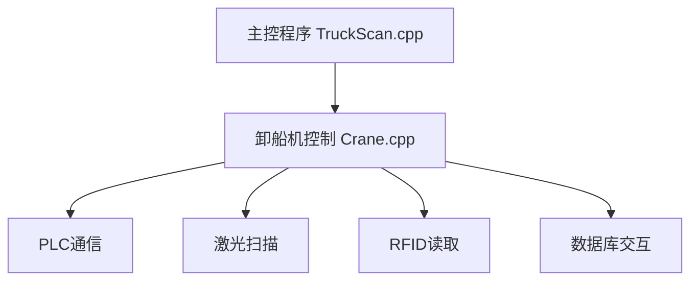
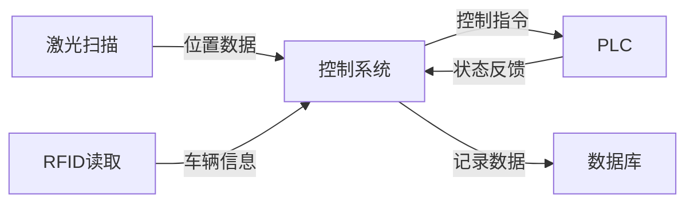

# 主要功能

让我分析一下 Crane.cpp 的主要功能：

<think>
1. 从代码结构和命名看，这是一个卸船机（Crane）控制系统的实现文件
2. 主要功能模块：
- 扫描器控制（激光扫描）
- RFID读取
- PLC通信
- 叉车控制
- 数据库操作
3. 核心业务逻辑：
- 检测卡车位置
- 控制装卸过程
- 安全监控
</think>

Crane.cpp 的主要功能：

1. 设备通信与控制：

```cpp
- 连接PLC：plc.ConnectTo(ipPLC, 0, 1)
- 扫描器通信：ConnectScan()
- RFID读取：OpenNetPort(6000, ipRFID, &fComAdr, &frmcomportindex)
```

2. 核心业务功能：

```cpp
Crane::ReadPLC()      // 读取PLC数据（设备状态）
Crane::Scan()         // 激光扫描检测卡车位置
Crane::Identify()     // RFID识别卡车信息
Crane::Calculate()    // 计算控制参数
Crane::WritePLC()     // 写入控制指令到PLC
```

3. 主要监控参数：

```cpp
CraneState  // 卸船机状态（0：空闲，1：卸货，2：装货）
TruckHave   // 是否有卡车在位
GrabTotal   // 需要抓取的次数
dTruckHead  // 卡车头部位置
dTruckTail  // 卡车尾部位置
```

简单来说，这个文件实现了一个自动化卸船系统，它能：

1. 自动检测卡车位置
2. 识别卡车信息
3. 控制卸船机进行装卸操作
4. 确保整个过程的安全性
5. 与数据库交互记录操作信息

这是一个工业自动化控制系统的核心组件。

# 工作流程

让我系统地解释这个卸船机控制系统的工作流程：

<think>
需要从以下几个方面解析：

1. 整体架构
2. 工作流程
3. 关键组件
4. 数据流向
   `</think>`

### 1. 系统架构



### 2. 工作循环

每个卸船机的工作循环（在 BeginCrane 函数中）：

```cpp
while(true) {
    1. Init()      // 初始化系统
    2. ReadPLC()   // 读取设备状态
    3. ForkliftPause() // 检查叉车安全
    4. Scan()      // 扫描卡车位置
    5. Identify()  // RFID识别卡车
    6. Calculate() // 计算控制参数
    7. WritePLC()  // 发送控制指令
}
```

### 3. 关键状态参数

```cpp
CraneState: 
    0 = 空闲
    1 = 卸货中
    2 = 装货中

TruckHave:
    0 = 无卡车
    1 = 有卡车

HopPos:    // 抓斗位置
GrabNum:   // 已抓取次数
GrabTotal: // 需要抓取总次数
```

### 4. 主要功能模块

1. **位置检测**：

```cpp
Scan() {
    // 使用激光扫描仪
    // 检测卡车头部位置(dTruckHead)
    // 检测卡车尾部位置(dTruckTail)
    // 判断卡车是否在正确位置
}
```

2. **车辆识别**：

```cpp
Identify() {
    // 读取RFID标签
    // 查询数据库获取车辆信息
    // 确定装卸任务参数
}
```

3. **安全控制**：

```cpp
ForkliftPause() {
    // 检测叉车RFID
    // 必要时暂停操作
    // 确保作业安全
}
```

### 5. 数据流向



### 6. 错误处理

系统在各个环节都有错误检查：

```cpp
- 设备连接状态检查
- 数据有效性验证
- 位置范围检查
- 安全参数监控
```

这个系统的主要目的是：

1. 自动化控制卸船机的装卸过程
2. 确保作业安全性
3. 提高作业效率
4. 记录作业数据

需要我详细解释任何特定部分吗？

# 代码结构分析

这个代码的整体结构是：

1. 基础设置部分（1-40行）

   - 头文件包含和宏定义
   - 构造函数（设置设备参数）
   - 析构函数（清理资源）
2. 核心初始化和状态控制部分（42-108行）

   - Init函数（初始化各种状态参数）
   - ReadPLC函数（读取PLC设备状态）
3. 安全监控部分（110-283行）

   - ForkliftPause函数（处理叉车安全控制）
   - RFID读取和数据库交互
4. 主要业务逻辑部分（285-489行）

   - Scan函数（扫描检测）
   - Identify函数（车辆识别）
   - Calculate函数（参数计算）
5. 设备通信部分（491-544行）

   - WritePLC函数（写入控制指令）
   - ConnectScan函数（扫描器连接）
6. 硬件驱动实现部分（546-1024行）

   - GetSICKLMS511函数（SICK扫描仪数据处理）
   - GetXXWXTL302函数（XT-L302扫描仪数据处理）
   - 

逐行分析 Crane.cpp 的结构：

1. 第1-11行：头文件和宏定义

```cpp
#define MAX_BUFF_SIZE 16384
#define MAX_REC_NUM 10
#define _USE_MATH_DEFINES
// ... 各种头文件包含
```

作用：定义常量和引入必要的系统及自定义头文件

2. 第13-32行：构造函数

```cpp
Crane::Crane(const char* Scan, const char* RFID, const char* PLC, const char* Forklift, int ScanType, unsigned char No,int Range, CDBConnetPool& DBPool)
```

作用：初始化卸船机对象，设置各种参数

3. 第34-40行：析构函数

```cpp
Crane::~Crane()
```

作用：清理资源，关闭连接

4. 第42-67行：Init() 函数

```cpp
int Crane::Init()
```

作用：初始化卸船机状态参数

5. 第69-108行：ReadPLC() 函数

```cpp
int Crane::ReadPLC()
```

作用：从PLC读取当前设备状态数据

6. 第110-283行：ForkliftPause() 函数

```cpp
void Crane::ForkliftPause()
```

作用：处理叉车安全控制，读取RFID信息判断是否需要暂停

7. 第285-321行：Scan() 函数

```cpp
int Crane::Scan()
```

作用：控制扫描器检测卡车位置

8. 第323-447行：Identify() 函数

```cpp
int Crane::Identify()
```

作用：识别卡车RFID，查询数据库获取相关信息

9. 第449-489行：Calculate() 函数

```cpp
int Crane::Calculate()
```

作用：根据扫描和识别结果计算控制参数

10. 第491-544行：WritePLC() 函数

```cpp
int Crane::WritePLC()
```

作用：将计算结果写入PLC控制设备

11. 第546-687行：ConnectScan() 函数

```cpp
int Crane::ConnectScan()
```

作用：建立与扫描器的网络连接

12. 第689-845行：GetSICKLMS511() 函数

```cpp
int Crane::GetSICKLMS511()
```

作用：处理SICK LMS511型激光扫描仪的数据

13. 第847-1024行：GetXXWXTL302() 函数

```cpp
int Crane::GetXXWXTL302()
```

作用：处理XT-L302型激光扫描仪的数据

每个部分都包含了详细的错误处理和日志记录功能，确保系统运行的可靠性。
