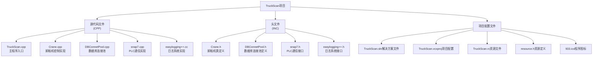

让我帮您分析项目结构。

<think>
需要先列出所有文件，然后分析它们的功能和关系，最后用mermaid图表展示。我将使用list_dir工具来查看项目结构。
</think>

根据文件内容分析，我来总结每个文件的作用：

1. 源代码文件 (CPP/):

- `TruckScan.cpp`: 主程序入口，负责初始化和创建卸船机控制线程
- `Crane.cpp`: 卸船机控制核心实现，包含扫描、识别、PLC通信等功能
- `DBConnetPool.cpp`: 数据库连接池实现，管理数据库连接
- `snap7.cpp`: S7 PLC通信协议实现
- `easylogging++.cc`: 日志系统实现

2. 头文件 (INC/):

- `Crane.h`: 卸船机类定义，声明主要控制接口
- `DBConnetPool.h`: 数据库连接池类定义
- `snap7.h`: S7 PLC通信协议接口定义
- `easylogging++.h`: 日志系统接口定义

3. 项目文件:

- `TruckScan.sln`: Visual Studio解决方案文件
- `TruckScan.vcxproj`: 项目配置文件
- `TruckScan.vcxproj.filters`: 项目文件过滤器
- `TruckScan.rc`: 资源文件
- `resource.h`: 资源定义头文件
- `933.ico`: 程序图标

让我用mermaid图表来展示项目结构：

系统架构说明：

1. 这是一个基于Windows的C++项目，使用Visual Studio开发
2. 主要功能是控制多台卸船机的自动化操作
3. 核心功能模块包括：
   - 卸船机控制系统
   - PLC通信接口
   - 数据库连接管理
   - 日志记录系统
4. 采用多线程架构，每台卸船机由独立线程控制
5. 使用S7协议与PLC通信，实现设备控制
6. 使用数据库连接池优化数据库访问性能
7. 使用easylogging++提供完整的日志记录功能
